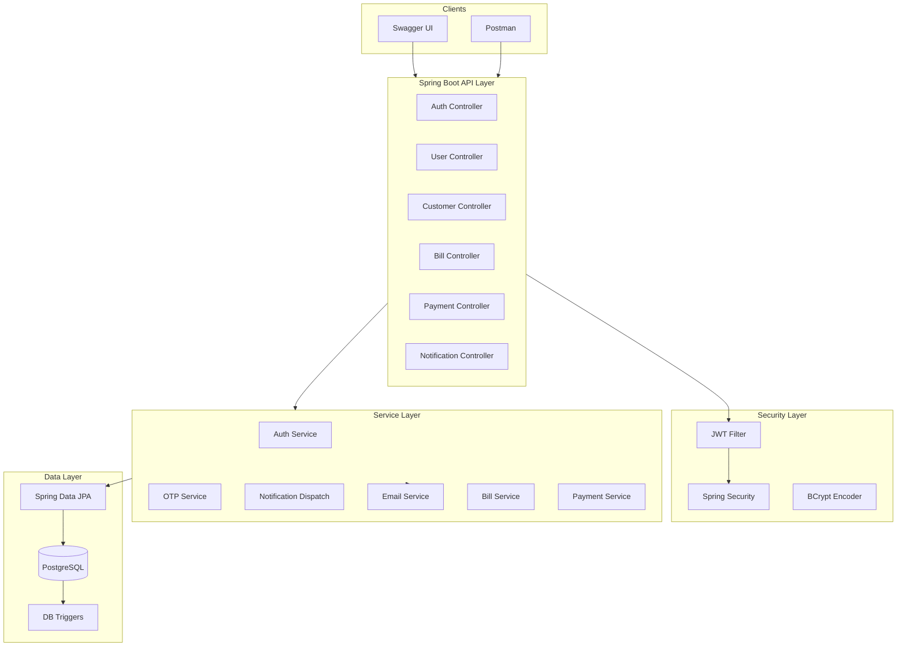

# System Architecture Diagram — Utility Billing System

## High-Level Architecture



## Module Dependencies

| Module | Depends On |
|--------|------------|
| Authentication | OTP Service, Email Service, Audit Log |
| User Management | Notification Dispatch, Email Service |
| Customer Management | OTP Service, Auth (self-register) |
| Bill Management | Tariff, Meter Reading, Notification Dispatch |
| Payment Management | Bill, Notification Dispatch |
| Notification | Email Service, PostgreSQL triggers |

## Security Architecture

- **Stateless JWT** — no server sessions
- **BCrypt** — all passwords hashed
- **Token blacklist** — logout invalidates tokens
- **Account locking** — 5 failed attempts → 15 min lock
- **OTP rate limiting** — max 3 requests per 10 minutes
- **Role-based access** — `@PreAuthorize` on all secured endpoints

## Deployment

```
PostgreSQL (utility_billing_db)
    ↑
Spring Boot App (port 8080)
    ├── Swagger UI (/swagger-ui.html)
    ├── Actuator (/actuator/health)
    └── File storage (uploads/)
```
