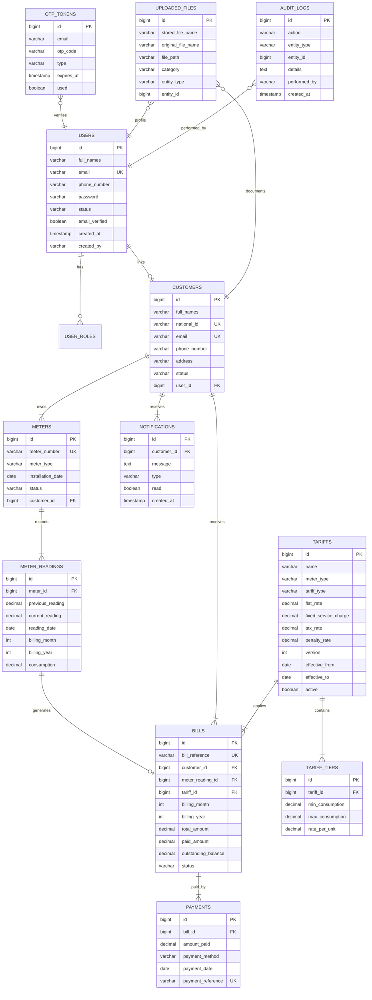

# Entity Relationship Diagram — Utility Billing System

## Overview

PostgreSQL relational database for WASAC/REG utility billing (water postpaid, electricity transitioning to postpaid).

## ERD (Mermaid)

## Key Constraints

| Rule | Implementation |
|------|----------------|
| Unique customer national ID / email | DB unique + service validation |
| One reading per meter/month/year | Unique constraint on `(meter_id, billing_month, billing_year)` |
| Tariff versioning | `version` column; previous tariffs deactivated on new effective date |
| Bill approval before payment | `BillStatus.APPROVED` check in `PaymentService` |
| Inactive customer/meter rules | Enforced in `BillService` and `MeterReadingService` |

## Database Triggers

1. **trg_bill_generated_notification** — After INSERT on `bills`, inserts notification row.
2. **trg_bill_paid_notification** — After UPDATE on `bills` when status becomes PAID and balance is zero.
