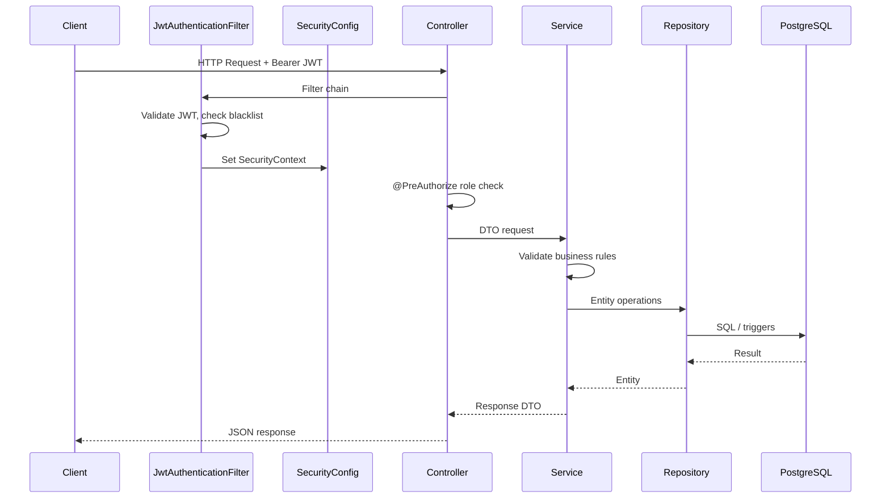
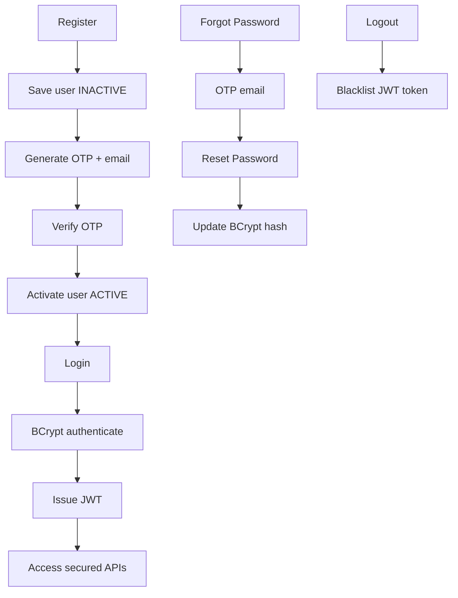
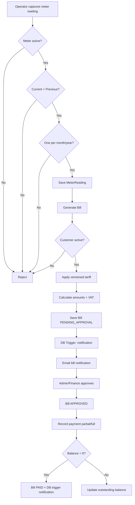

# Spring Boot Flow Diagram — Utility Billing System

## Architecture Layers

```
Client (Postman / Swagger)
        │
        ▼
┌───────────────────────────────────────────────────────────┐
│  Controller Layer (REST + @PreAuthorize role checks)    │
│  Auth, User, Customer, Meter, Reading, Tariff, Bill,    │
│  Payment, Notification, File, AuditLog                  │
└─────────────────────────┬─────────────────────────────────┘
                          │
                          ▼
┌───────────────────────────────────────────────────────────┐
│  Service Layer (business rules + transactions)            │
└─────────────────────────┬─────────────────────────────────┘
                          │
          ┌───────────────┼───────────────┐
          ▼               ▼               ▼
   Repository         Mapper/DTO      Utilities
   (Spring Data JPA)  (no entities    (Email, OTP, File,
                       exposed)        TariffCalculator)
                          │
                          ▼
                   PostgreSQL + Triggers
```

## Request Flow (Authenticated API)



## Authentication Flow



## Billing Flow



## Role Access Summary

| Module | ADMIN | OPERATOR | FINANCE | CUSTOMER |
|--------|-------|----------|---------|----------|
| Tariffs | CRUD | — | Read | — |
| Meter readings | CRUD | Create/Read | Read | — |
| Bills | Generate/Approve | — | Generate/Approve | Read own |
| Payments | CRUD | — | Create/Read | Read |
| Customers | CRU | CRU | Read | Self-register + Read |
